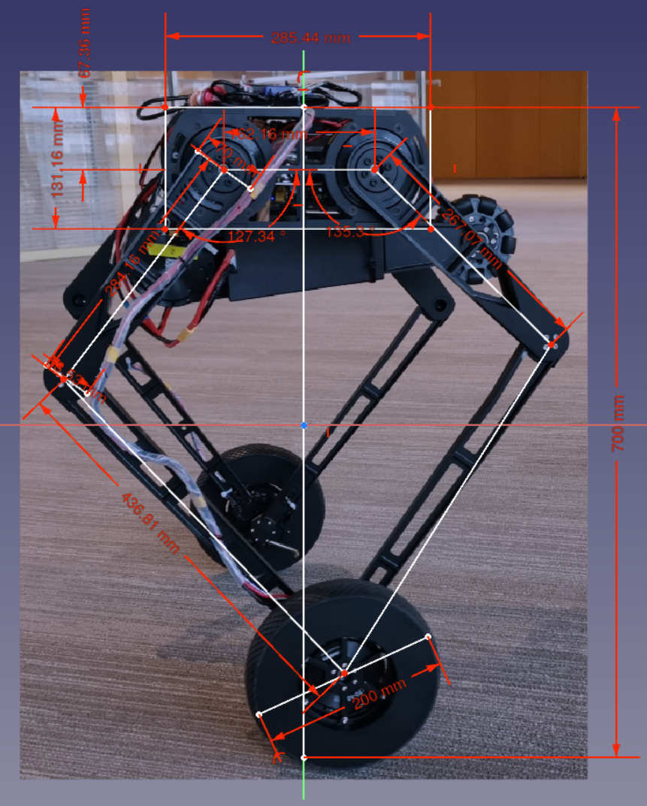
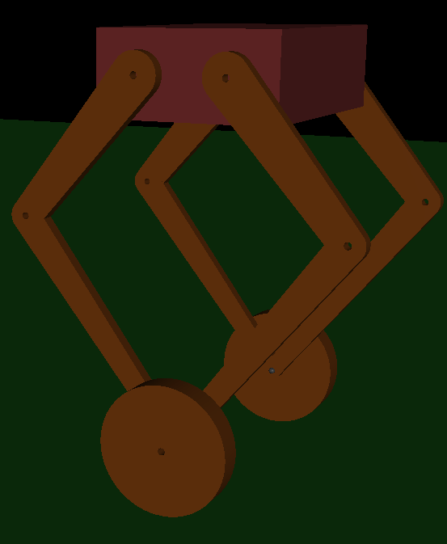
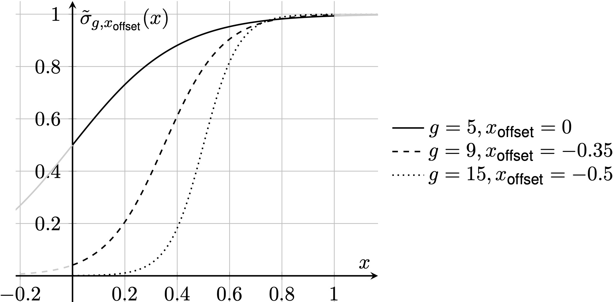
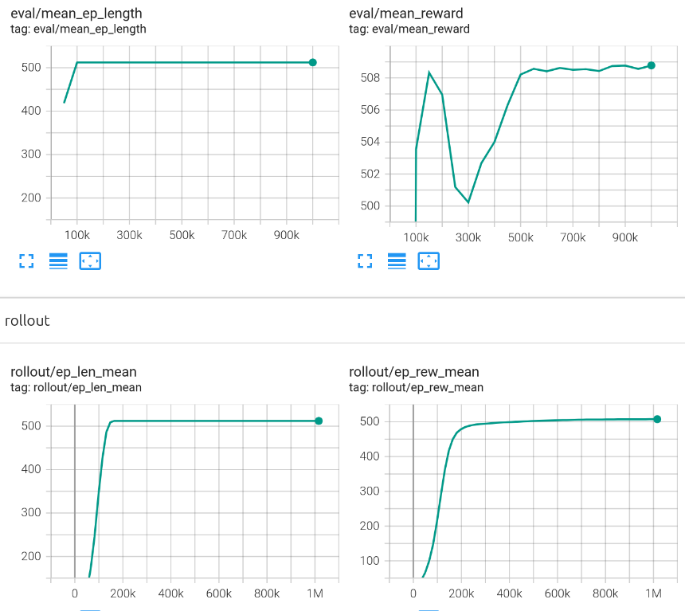
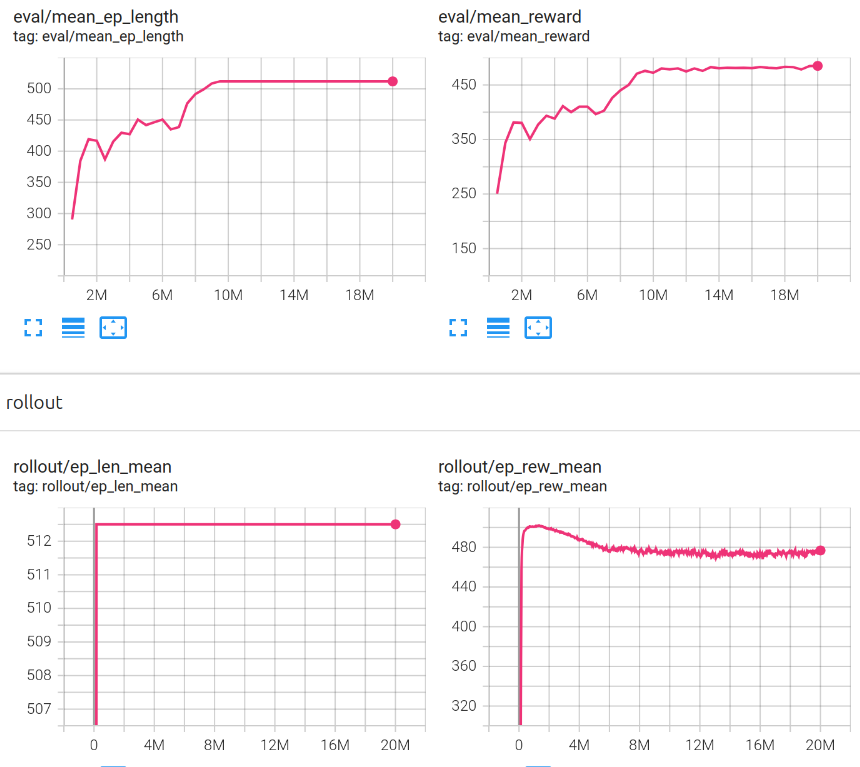
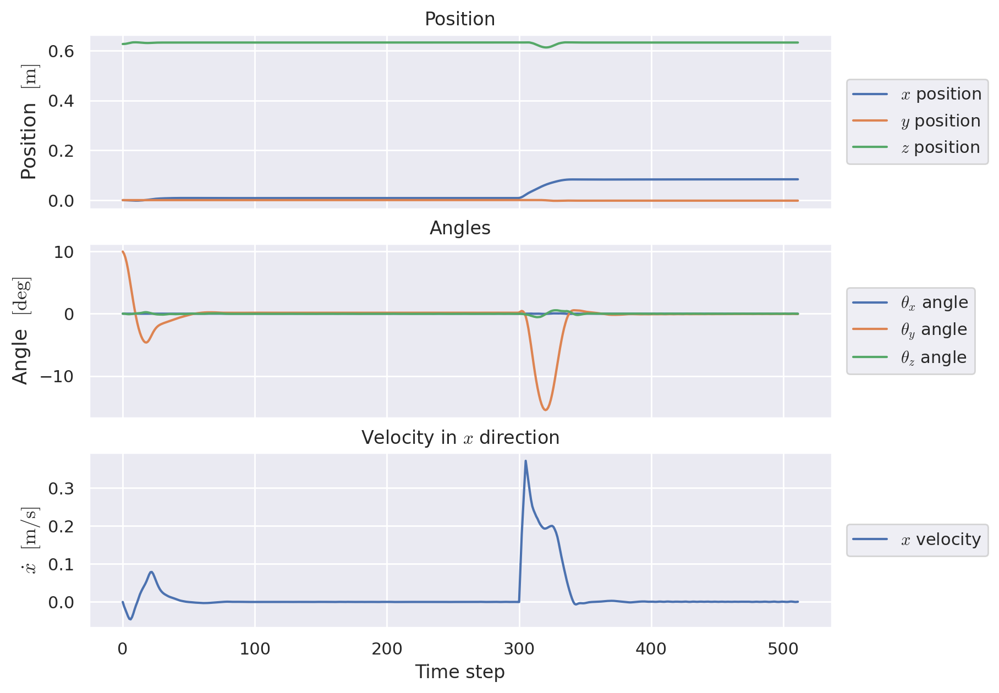
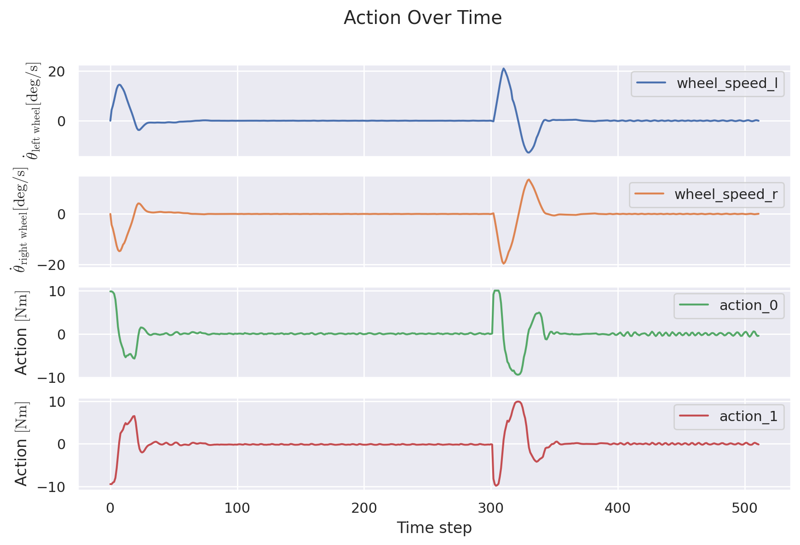
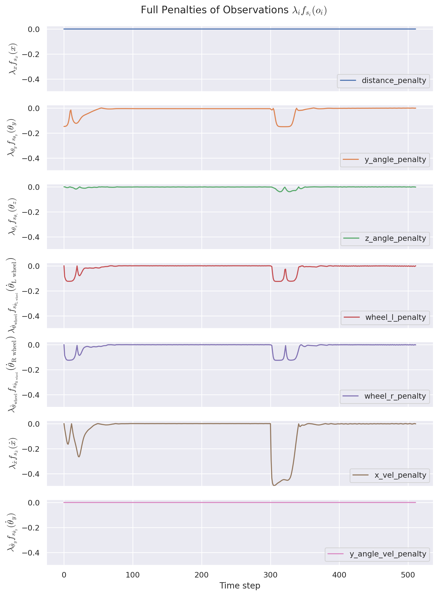
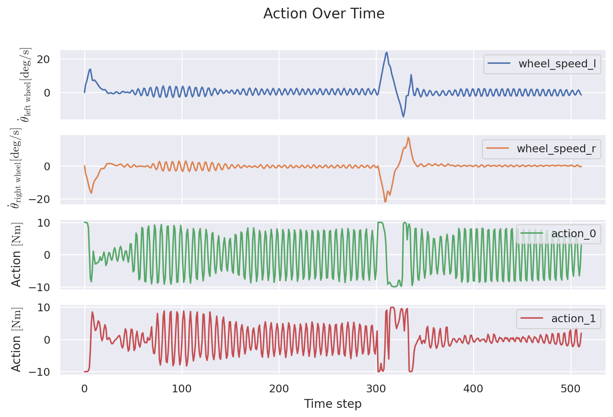

# Learning Balance Control PNU2025-1

This is the project repository for our course "Artificial Intelligence in Robotics"
at the Pusan National University, South Korea.

## Content
1. Introduction
2. Physics Simulation
3. Training
4. Approach
5. Achievements


## Introduction

The idea for the project came from the following paper:
[Balance Control of a Novel Wheel-legged Robot: Design and Experiments](https://ieeexplore.ieee.org/document/9561579)

We want to replace the LQR controller for keeping the robot upright with a learned policy.

Our project goals are as follows:

1. Setup of the simulation environment and integration with the machine learning framework. ✅
2. Definition of the robot geometry and training a proof of concept controller for a simple and static
robot state. ✅
3. Training a controller to balance the robot in its upright equilibrium position while allowing for changing height. ✅
4. Improving the controller further by introducing random starting angles and applying a force impulse during the episode. ✅

## Physics Simulation


We approximated the robot in the MuJoCo simulation environment by estimating the dimensions from one
of the papers pictures and Table I:




#TODO

## Training
The training is based on the [MuJoCo Environment](https://gymnasium.farama.org/environments/mujoco/) implemented by the gymnasium project. Our robot environment is adapted from the
[MuJoCo Cartpole](https://gymnasium.farama.org/environments/mujoco/inverted_pendulum/) environment.

### Environment
The environment takes arguments for configuring the behavior such as changing the robots'
height, maximum perturbation angles and forces, and other settings.

The environment implements the possibility to introduce the following perturbations
during training which are scaled by the current difficulty level to enable curriculum learning:
- Random height 
- Random y-angle upon reset
- Application of a force within a configurable time step window

The action space is a 2-dimensional action in $[-10, 10]$ where each value represents
the torque applied by the wheels' actuator.

The observation space is the bots position and rotation, the rotational speed of the wheels,
the robots x-velocity and y-angular-velocity.

### High level training
We have implemented training for two algorithms: Stable Baselines3 [PPO](https://stable-baselines3.readthedocs.io/en/master/modules/ppo.html) and [SAC](https://stable-baselines3.readthedocs.io/en/master/modules/sac.html)

The configuration of a training is stored in a YAML file which has to be provided as an
argument when starting the training. Basic configuration files for [PPO](./training/basic_PPO.yaml) and [SAC](./training/basic_SAC.yaml) with all necessary
entries are provided. In addition to that there is command line arguments to further
configure the training process.

The training can be parallelized. Each additional training environment (can be set
with ``--num_envs n``) consumes around 230 MB of RAM.

A training can be started with a pretrained model to continue with different settings
or perturbations (provide path to zip with ``--cont_train X``)

The general training process is as follows:

1. Setup of training parameters
2. Initialization of the training and evaluation environment
3. Setup of the checkpoint, evaluation and curriculum callbacks
4. Preparation of the policy to train (SAC: optional warmup of the replay buffers with a pretrained PPO policy)
5. Training of the policy with checkpoints, curriculum calculation and evaluation
6. Final evaluation and policy saving (same name as ``.YAML`` file)


#### Curriculum Learning
The curriculum learning callback calculates a difficulty scalar $[0, 1]$ depending on
the current training step progress $`x := \frac{n_{step}}{N_{step}}`$ and sets the
difficulty in the environment(s). The difficulty function can be configured, the
default is a sigmoid function $\sigma(x)$ which showed the best results during our trainings.
We introduce two tuning parameters here:
$g$ controls the slope or growth and $x_\text{offset}$ shifts horizontally.
Since our step progress $x$ is $\in [0, 1]$, the starting difficulty will be at the $y$-intercept.

$`
\sigma(x) = \dfrac{1}{1 + e^{-g(x + x_{\text{offset}})}}
`$




#### Reward Function
At first we tried a simple reward function that uses the square of the measured sensor data 
$(\cdot)^2$ (to make sure the result is positive and smooth) together with a corresponding 
customizable penalizing factor $`\lambda_{(\cdot)}`$. 
This was combined with a constant bonus $`c_\text{alive bonus}`$ if the robot is *alive*.

#TODO war hier x wirklich linear?

$`
\text{reward} = c_\text{alive bonus} -
\lambda_{\theta_y} {\theta_y}^2 -
\lambda_{\theta_x} {\theta_x}^2 -
\lambda_{\dot \theta_\text{wheel}}\left( {\dot\theta_\text{left wheel}}^2 + {\dot\theta_\text{right wheel}}^2 \right) -
\lambda_{x} x^2
`$

But in an effort to bound the reward for more consistent training with SAC in particular,
we introduced a function $f$ which makes use of the sigmoid function $\sigma(x)$ and bounds
each of our measured sensor data between $[0,1]$

$`
\begin{align}
f(x) &= 2 \, \sigma(s|x|) - 1 \\
     &= \dfrac{2}{1 + e^{-s|x|}} - 1
\end{align}
`$

where $`s`$ scales the "slope" of the function and is used to adjust to the common range of $`x`$.


When we then specify, that $`\sum_i \lambda_i = 1`$ and $`c_\text{alive\_bonus} \in [0, 1]`$, our reward
is bounded above by $`1`$

$`
\text{reward} = c_\text{alive bonus} -
\lambda_{\theta_y} f(\theta_y) -
\lambda_{\theta_x} f(\theta_x) -
\lambda_{\dot \theta_\text{left wheel}} f\bigl(\dot\theta_\text{left wheel}\bigr) +
\lambda_{\dot \theta_\text{left wheel}} f\bigl(\dot\theta_\text{right wheel}\bigr) -
\lambda_{x} f(x) \leq 1
`$


## Achievements
#TODO


### Basic training without perturbation
Basic training without any perturbations (height change is still enabled) achieves good results
with very little training. All evaluation episodes run to completion after only 100k steps.
This keeps being the case even as the curriculum introduces different height levels.


### Training with initial angle perturbation

### Training with initial angle and force perturbation
Through experimenting we achieved the following [configuration](./trained_models/PPO_10deg_rand_force_6.yaml).
The reward function ignores the distance from zero (positioning is considered a higher level control problem) and y-angle velocity. Heavy emphasis is laid on the x speed to avoid big movements. The wheel speed penalty
mitigates oscillations.

```
# Reward setup
healthy_reward: 1

y_angle_pen: 0.15
y_angle_scale: 0.5

z_angle_pen: 0.1
z_angle_scale: 1.5

dist_pen: 0.0
dist_scale: 15.0

wheel_speed_pen: 0.125
wheel_speed_scale: 0.4

x_vel_pen: 0.5
x_vel_scale: 15.0

y_angle_vel_pen: 0.0
y_angle_vel_scale: 1.0
```

The training progress was as follows:


With this the influence of the curriculum learning can be observed. Initially the policy quickly
reaches the optimal reward, which then gradually begins to decrease until it stays on more or less the
same level in the end. The evaluation takes some time before it starts to survive consistently because
the evaluation is not influenced by the current difficulty level.

The resulting policy is robust against perturbations of up to 20 degrees initially (max. during training: 10) and
a force perturbation of 100 Nm. There is a low amount of oscillation present, as can be seen from the
following graphs:





### SAC
Training SAC on the environment has proven to be more difficult. The results were acceptable,
however more refinement has to be carried out to mitigate quirks of the policy. SAC
tends to send actions which are more at the extreme ends of the action space, thus introducing
high torque spikes and "upset" behavior. A penalty for high action inputs could solve this
problem, however time constraints did not allow for additional training iterations.

