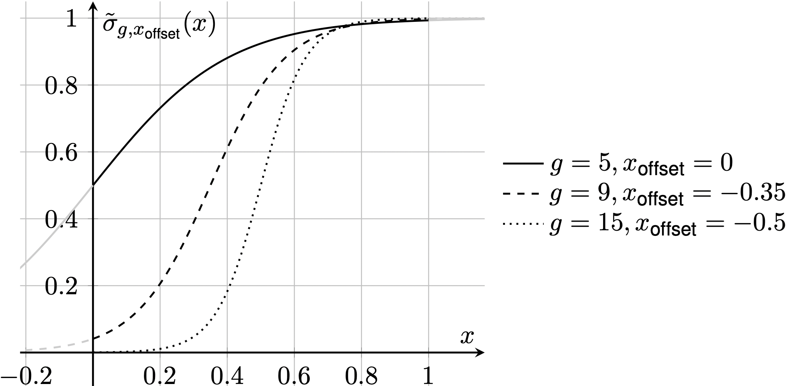
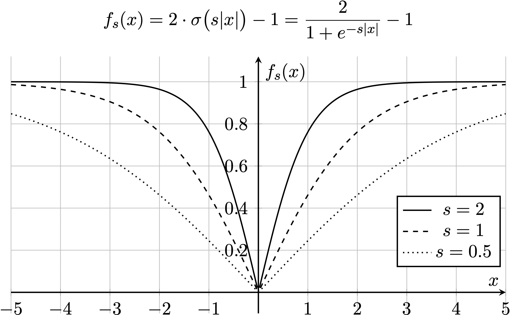

# Learning Balance Control PNU2025-1

This is the project repository for our course "Artificial Intelligence in Robotics"
at the Pusan National University, South Korea.

## Content
1. Introduction
2. Physics Simulation in MuJoCo
3. Training
4. Achievements


## 1. Introduction

Wheel-legged robots are a promising class of mobile robotic systems that combine the energy efficiency of wheels with the terrain adaptability of legs. This hybrid design makes them well-suited for unstructured or dynamic environments, such as exploration and delivery, where both mobility and stability are essential.

However, designing control strategies for such systems can be complex. Their inherently unstable structure presents challenges such as:

- Upright instability resembling the inverted pendulum problem which is non-linear in nature
- Sensitivity to perturbations like external forces and terrain changes  
- Varying kinematics during height adjustments  

Traditional control approaches require accurate system models, which are difficult to derive and often lack robustness in uncertain real-world scenarios.

### Idea

In this project, we propose a learning-based control approach using reinforcement learning (RL) to tackle the balance control problem of a wheel-legged robot. Rather than hand-designing controllers based on mathematical models, we aim to train a policy that learns to stabilize the robot in an upright position through interaction with a simulated environment.

### Foundations and Related Work

Our work builds directly on the research by S. Wang et al. in the paper *“[Balance Control of a Novel Wheel-legged Robot: Design and Experiments](https://ieeexplore.ieee.org/document/9561579)”*, where they present a physical prototype of a wheel-legged robot and evaluate both linear and nonlinear controllers for stabilization. 
We want to replace the LQR controller used in the paper with a learned policy in order to keep the robot upright.


We also draw upon standard tools and methods in reinforcement learning:
- The [Gymnasium](https://arxiv.org/abs/2407.17032) framework, as introduced by Mark Towers et al., which provides a structured interface for building and interacting with RL environments.
- The [MuJoCo](https://mujoco.readthedocs.io/en/stable/overview.html) (Multi-Joint dynamics with Contact) physics simulation 
- A wide range of foundational deep RL methods, informed by OpenAI’s recommended collection of [Key Papers in Deep Reinforcement Learning](https://spinningup.openai.com/en/latest/spinningup/keypapers.html).

These provide a solid foundation with which we build our learning environment, robot simulation, and training infrastructure.

### Project Goals

Our primary goal is to train a learned controller that can balance the wheel-legged robot in a standing equilibrium state without relying on a predefined analytical model.

A secondary objective is to increase the controller’s robustness by:
- Allowing for **height changes**, simulating real-world adjustments in robot posture
- Gradually exposing the agent to **external perturbations** during training to improve generalization

### Research Plan

To achieve our goals, we have outlined a structured four-phase plan:

1. **Simulation and Environment Setup ✅**  
   Set up a model of the robot in a physics simulation. Develop a custom environment that includes state observation, action space definition, and a reward function based on balance criteria.

2. **Proof-of-Concept Controller ✅**  
   Train an initial policy to stabilize a simplified version of the robot in a fixed height configuration, similar to solving an inverted pendulum problem.

3. **Height Control ✅**  
   Extend the task by enabling dynamic height changes during operation. Retrain or fine-tune the policy to maintain balance while adapting the robot’s height, increasing the complexity and realism of the task.

4. **Introduction of Perturbations ✅**  
   Introduce perturbations such as force application or random starting angles to simulate real-world noise. This will help generalize the policy and make it robust against a wider range of conditions.

---

## 2. Physics Simulation in MuJoCo
We used MuJoCo to simulate a wheel-legged robot learning robust balance strategies. 
MuJoCo is a high-performance physics engine designed for simulating articulated structures in contact-rich environments. It is widely used in robotics, reinforcement learning, and biomechanics due to its speed, accuracy, and modeling flexibility.

### Model Definition 

MuJoCo models are defined in **MJCF**, an XML-based format. Key components include:

- `<body>`: Defines rigid bodies and their hierarchy
- `<joint>`: Specifies degrees of freedom (hinge, slide, ball, etc.)
- `<geom>`: Defines collision shapes and visual geometry
- `<actuator>`: Adds motors, muscles, or tendons
- `<sensor>`: Enables measurement of forces, positions, velocities, etc.

We approximated the robot in the MuJoCo simulation environment by estimating the dimensions from one
of the papers pictures and Table I, and added the necessary links and two actuators for the wheel speeds. 
Our observation function uses these actuators states and a sensor detecting velocity and angular velocity of the main body to measure the system performance.


### Challenges faced during model implementation

When we first applied our model in simulation, we experienced difficulties as the model's joints behaved shaky and our simulation showed to be numerically unstable depending on the starting conditions. 

In the beginning, the wheels penetrated the floor plane of our model. 
We figured out that this failure occurred because our wheels' density was set too low and thereby instabilities
arose. To increase the accuracy of our model, the bodies densities are set to approximate the given masses of the original. 

Also, to allow the variation of the height of the robot actors are placed on the respective main body hinges. These actors
implement a controller holding the appropriate angular position for the set height. Changing the height at the start of
each episode by simply setting a position for the actors turned out to be insufficient. The controller's behavior proved
to be unstable in case of angles far from the default value. This issue was solved by usage of a critically damped controller
and setting the height by precomputing the appropriate angles of all hinges to avoid violent motions at the start of a simulation.


### Further Reading

- [MuJoCo Modeling Documentation](https://mujoco.readthedocs.io/en/stable/modeling.html)  
- [MuJoCo Overview and Architecture](https://mujoco.readthedocs.io/en/stable/overview.html)  
- [MuJoCo GitHub Repository](https://github.com/google-deepmind/mujoco)  

## 3. Training
The training is based on the [MuJoCo Environment](https://gymnasium.farama.org/environments/mujoco/) implemented by the gymnasium project. Our robot environment is adapted from the
[MuJoCo Cartpole](https://gymnasium.farama.org/environments/mujoco/inverted_pendulum/) environment.

### Environment

[//]: # (The environment takes cofiguration arguments for configuring the behavior such as changing the robots')
[//]: # (height, maximum perturbation angles and forces, and other settings.)

The environment implements configurable perturbations that are progressively scaled by the current difficulty 
given by curriculum learning:
- Uniformly random height upon reset
- Uniformly random y-angle upon reset
- Force application $`\mathcal{U}\{-F, 0, F\}`$ within a configurable time window

The action space $`\mathcal{A} = [-10, 10]^2 \in \mathbb{R}^2`$ where each value represents
the torque applied to each wheels' actuator.

The observation space collects the bots position $\vec x$ and rotation $\vec \theta$, the rotational wheel speed 
$`\dot\theta_\text{L/R wheel}`$, the robot's x-velocity $`\dot x`$ and y angular velocity $`\dot \theta_y`$.

### High level training
We have implemented training for two algorithms: Stable Baselines3 [PPO](https://stable-baselines3.readthedocs.io/en/master/modules/ppo.html) and [SAC](https://stable-baselines3.readthedocs.io/en/master/modules/sac.html)

The configuration of a training is stored in a ``.YAML`` file which has to be provided as an
argument when starting the training. Basic configuration files for [PPO](./training/basic_PPO.yaml) and [SAC](./training/basic_SAC.yaml) with all necessary
entries are provided. In addition to that there are command line arguments to
configure the training process further.

The training can be parallelized. Each additional training environment (can be set
with ``--num_envs n``) consumes around 220 MB of RAM.

A training can be started with a pretrained model to continue with different settings
or perturbations (provide path to zip with ``--cont_train X``)

The general training process is as follows:

1. Setup of training parameters
2. Initialization of the training and evaluation environment
3. Setup of the checkpoint, evaluation and curriculum callbacks
4. Preparation of the policy to train (SAC: optional warmup of the replay buffers with a pretrained PPO policy)
5. Training of the policy with checkpoints, curriculum calculation and evaluation
6. Final evaluation and policy saving (same name as ``.YAML`` file)


#### Curriculum Learning
[CurriculumCallback.py](CurriculumCallback.py) calculates a difficulty scalar $[0, 1]$ depending on
the current training step progress $`x := \frac{n_{step}}{N_{step}}`$ and sets the
difficulty in the environment(s). The underlying difficulty function used can be configured, with the
default being a sigmoid function

$`\tilde\sigma_{g,x_\text{offest}}(x) = \dfrac{1}{1 + e^{-g(x + x_{\text{offset}})}}\;,`$

which showed the best results during our trainings.
We introduced two tuning parameters here:
$g$ controls the slope or _growth_ and $x_\text{offset}$ shifts horizontally.
Since our step progress $x$ is $\in [0, 1]$, the starting difficulty will be at the $y$-intercept.

<figure>
    
    <figcaption>Some variations of the difficulty function using different parameters.</figcaption>
</figure>

#### Reward Function
At first we tried a very simple reward function that uses the square of the measured sensor data 
(observation) ${o_i}^2$ (to make sure the result is positive and smooth) together with a 
corresponding customizable penalizing factor $`\lambda_{i}`$. 
This was combined with a constant bonus $`c_\text{alive}`$ if the robot is _alive_:

$`\text{reward} = c_\text{alive} - \sum_{i} \lambda_{i} \, {o_i}^2`$

and for our specific setup:

$`\text{reward} = c_\text{alive} - \lambda_{x} x^2 - \lambda_{\theta_x} {\theta_x}^2 - \lambda_{\theta_y} {\theta_y}^2 - \lambda_{\dot \theta_\text{wheel}}\left( {\dot\theta_\text{L wheel}}^2 + {\dot\theta_\text{R wheel}}^2 \right)\, .`$


To encourage more consistent training, particularly when using SAC, we introduced a bounding function

$`f_s: \mathbb{R} \rightarrow [0, 1]`$

that bounds each of the raw sensor data between $[0, 1]$ using a scaled sigmoid.

$`\begin{align} f_s(x) &= 2 \cdot \sigma\bigl(s|x|\bigr) - 1 \\ &= \dfrac{2}{1 + e^{-s|x|}} - 1 \end{align}`$

where $`s>0`$ controls the slope or steepness of the curve.
It is adjusted such that the gradients within the expected range of $`x`$ do not vanish.
This function ensures that large outliers or unbounded values do not dominate the reward during learning.

<figure>
    
    <figcaption>Some variations of the bounding function using different <em>s</em>.</figcaption>
</figure>
<!--  -->

So the reward becomes:

$`\begin{align} \text{reward} &= c_\text{alive} - \sum_{i} \lambda_{i} \, f_{s_i}(o_i) \\ &= c_\text{alive} - \lambda_{x} f_{s_x}(x) - \lambda_{\theta_x} f_{s_{\theta_x}}(\theta_x) - \lambda_{\theta_y} f_{s_{\theta_y}}(\theta_y) - \lambda_{\dot \theta_\text{wheel}} f_{s_{\dot\theta_\text{wheel}}}\bigl(\dot\theta_\text{L wheel}\bigr) + \lambda_{\dot \theta_\text{wheel}} f_{s_{\dot\theta_\text{wheel}}}\bigl(\dot\theta_\text{R wheel}\bigr) \leq 1\, , \end{align}`$

which is bounded above by $`1`$ when we then require, that $`\sum_i \lambda_i = 1`$ and $`c_\text{alive} \in [0, 1]`$.

---
## 4. Achievements
Through experimenting we achieved the following reward function setup:
```
# Reward setup
healthy_reward: 1

y_angle_pen: 0.15
y_angle_scale: 0.5

z_angle_pen: 0.1
z_angle_scale: 1.5

dist_pen: 0.0
dist_scale: 15.0

wheel_speed_pen: 0.125
wheel_speed_scale: 0.4

x_vel_pen: 0.5
x_vel_scale: 15.0

y_angle_vel_pen: 0.0
y_angle_vel_scale: 1.0
```
The reward function ignores the distance from zero (positioning is considered a higher level control problem) and y-angle velocity. Heavy emphasis is laid on the x speed to avoid big movements. The wheel speed penalty mitigates oscillations.

### Basic training without perturbation
Basic training without any perturbations (height change is still enabled) achieves good results
with very little training. All evaluation episodes run to completion after only 100k steps.
This keeps being the case even as the curriculum introduces different height levels.


### Training with initial angle and force perturbation


The training progress was as follows:


With this the influence of the curriculum learning can be observed. Initially the policy quickly
reaches the optimal reward, which then gradually begins to decrease until it stays on more or less the
same level in the end. The evaluation takes some time before it starts to survive consistently because
the evaluation is not influenced by the current difficulty level.

The resulting policy is robust against perturbations of up to 20 degrees initially (max. during training: 10) and
a force perturbation of 100 Nm. There is a low amount of oscillation present, as can be seen from the
following graphs:


### Training with a faster curriculum schedule and higher initial angles

### SAC
Training SAC on the environment has proven to be more difficult. The results were acceptable,
however more refinement has to be carried out to mitigate quirks of the policy. SAC
tends to send actions which are more at the extreme ends of the action space, thus introducing
high torque spikes and "upset" behavior. A penalty for high action inputs could solve this
problem, however time constraints did not allow for additional training iterations.

