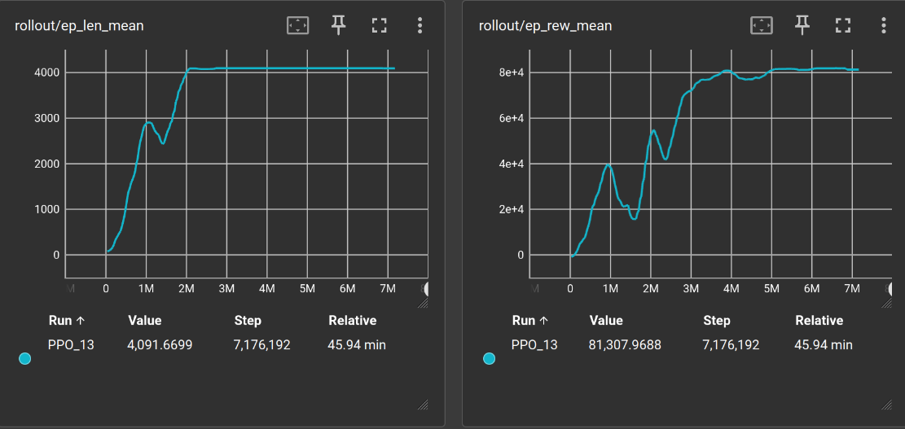

# Learning Balance Control PNU2025-1

This is the project repository for our course "Artificial Intelligence in Robotics"
at the Pusan National University, South Korea.

## Content
1. Introduction
2. Physics Simulation in MuJoCo
3. Training
4. Approach
5. Achievements

## 1. Introduction

Wheel-legged robots are a promising class of mobile robotic systems that combine the energy efficiency of wheels with the terrain adaptability of legs. This hybrid design makes them well-suited for unstructured or dynamic environments, such as exploration and delivery, where both mobility and stability are essential.

However, designing control strategies for such systems is complex. Their inherently unstable structure, especially during standing or posture adjustments, presents challenges such as:

- Nonlinear dynamics from wheel-leg interactions  
- Upright instability resembling the inverted pendulum problem  
- Sensitivity to perturbations like shifts in the center of gravity or terrain changes  
- Varying kinematics during height adjustments  

Traditional control approaches like PID or LQR require accurate system models, which are difficult to derive and often lack robustness in uncertain real-world scenarios.

### Motivation and Idea

In this project, we propose a learning-based control approach using reinforcement learning (RL) to tackle the balance control problem of a wheel-legged robot. Rather than hand-designing controllers based on mathematical models, we aim to train a policy that learns to stabilize the robot in an upright position through interaction with a simulated environment.

The idea is to frame the problem as a control task in a physics-based simulation environment and let the agent learn an optimal policy through trial and error. By using a deep reinforcement learning framework like Gymnasium, we can define a reward function that encourages the robot to remain balanced, penalize falls or unstable configurations, and eventually enable more advanced behaviors.

### Foundations and Related Work

Our work builds directly on the research by S. Wang et al. in the paper *“[Balance Control of a Novel Wheel-legged Robot: Design and Experiments](https://ieeexplore.ieee.org/document/9561579)”*, where they present a physical prototype of a wheel-legged robot and evaluate both linear and nonlinear controllers for stabilization. 
We want to replace the LQR controller used in the paper in order to keeping the robot upright with a learned policy.

We also draw upon standard tools and methods in reinforcement learning:
- The **Gymnasium** framework, as introduced by Mark Towers et al., which provides a structured interface for building and interacting with RL environments.
- A wide range of foundational deep RL methods, informed by OpenAI’s recommended collection of *Key Papers in Deep Reinforcement Learning*.

These provide a solid foundation upon which we build our learning environment, robot simulation, and training infrastructure.

### Project Goals

Our primary goal is to train a learned controller that can balance the wheel-legged robot in a standing equilibrium state without relying on a predefined analytical model.

A secondary objective is to increase the controller’s robustness by:
- Allowing for **dynamic height changes**, simulating real-world adjustments in robot posture
- Introducing **uncertainties in the robot’s center of gravity**, reflecting unpredictable or shifting payloads
- Gradually exposing the agent to **external perturbations** during training to improve generalization

### Research Plan

To achieve our goals, we have outlined a structured four-phase plan:

1. **Simulation and Environment Setup ✅**  
   Set up a physics simulation using PyBullet or Gazebo, and integrate it with Gymnasium. Develop a custom environment that includes state observation, action space definition, and a reward function based on balance criteria.

2. **Proof-of-Concept Controller ✅**  
   Define the robot’s geometry and dynamics as described in the referenced paper. Train an initial policy to stabilize a simplified version of the robot in a fixed height configuration, similar to solving an inverted pendulum problem.

3. **Dynamic Height Control ✅**  
   Extend the task by enabling dynamic height changes during operation. Retrain or fine-tune the policy to maintain balance while adapting the robot’s height, increasing the complexity and realism of the task.

4. **Robustness to Perturbations ✅**  
   Introduce mild randomization of physical parameters such as the center of gravity and add perturbations to simulate real-world noise. This will help generalize the policy and make it robust against a wider range of conditions.

---

## 2. Physics Simulation in MuJoCo

MuJoCo (Multi-Joint dynamics with Contact) is a high-performance physics engine designed for simulating articulated structures in contact-rich environments. It is widely used in robotics, reinforcement learning, and biomechanics due to its speed, accuracy, and modeling flexibility.

> We used MuJoCo to simulate a wheel-legged robot learning robust balance strategies. The simulation incorporated randomized terrain, friction variation, and noisy joint feedback. Accurate contact modeling helped improve controller generalization from simulation to reality.

### ⚙️ Core Simulation Principles

#### Generalized Coordinates
MuJoCo simulates systems using **generalized coordinates**, avoiding the over-constrained Cartesian formulations common in game engines. This allows for:
- Precise joint modeling
- Efficient recursive dynamics
- Stable constraint enforcement

#### Contact Dynamics via Convex Optimization
Unlike spring-damper approximations, MuJoCo formulates contact forces as **convex optimization problems**, enabling:
- Realistic friction modeling (Coulomb friction)
- Stable contact resolution
- Support for soft and hard contacts

### 🧩 Model Definition 

MuJoCo models are defined in **MJCF**, an XML-based format. Key components include:

- `<body>`: Defines rigid bodies and their hierarchy
- `<joint>`: Specifies degrees of freedom (hinge, slide, ball, etc.)
- `<geom>`: Defines collision shapes and visual geometry
- `<actuator>`: Adds motors, muscles, or tendons
- `<sensor>`: Enables measurement of forces, positions, velocities, etc.

We approximated the robot in the MuJoCo simulation environment by estimating the dimensions from one
of the papers pictures and Table I:

### 🧪 Physics Engine Features

- **Constraint Solver**: Solves equality and inequality constraints using Projected Gauss-Seidel or Conjugate Gradient methods  
- **Friction Cones**: Supports pyramidal and elliptic cones for dry friction modeling  
- **Soft Contacts**: Enables compliant (deformable) contact modeling for smoother behavior  
- **Time Integration**: Euler and Runge-Kutta integrators available for flexible simulation fidelity  
- **Inverse Dynamics**: Allows computation of required torques for a given motion trajectory, even under contact conditions

### 🤖 Application in Robot Learning

MuJoCo is highly suited for reinforcement learning and control system prototyping because of:

- **Deterministic simulation**: Guarantees repeatable rollouts for debugging and benchmarking  
- **Efficient performance**: High-speed simulation suitable for parallel training setups  
- **Precise dynamics**: Fine-grained control over physical parameters like joint range, damping, friction, and mass properties

### 📚 Further Reading

- [MuJoCo Modeling Documentation](https://mujoco.readthedocs.io/en/stable/modeling.html)  
- [MuJoCo Overview and Architecture](https://mujoco.readthedocs.io/en/stable/overview.html)  
- [MuJoCo GitHub Repository](https://github.com/google-deepmind/mujoco)  
- [GitHub Markdown Syntax Guide](https://docs.github.com/en/get-started/writing-on-github/getting-started-with-writing-and-formatting-on-github/basic-writing-and-formatting-syntax)

---
## 3. Training
The training is based on the [MuJoCo Environment](https://gymnasium.farama.org/environments/mujoco/) implemented by the gymnasium project. Our robot environment is adapted from the
[MuJoCo Cartpole](https://gymnasium.farama.org/environments/mujoco/inverted_pendulum/) environment.

### Environment
The environment takes arguments for configuring the behavior such as changing the robots'
height, maximum perturbation angles and forces, and other settings.

The environment implements the possibility to introduce the following perturbations
during training which are scaled by the current difficulty level to enable curriculum learning:
- Random height 
- Random y-angle upon reset
- Application of a force within a configurable time step window

The action space is a 2-dimensional action in $[-10, 10]$ where each value represents
the torque applied by the wheels' actuator.

The observation space is the bots position and rotation, the rotational speed of the wheels,
the robots x-velocity and y-angular-velocity.

### High level training
We have implemented training for two algorithms: Stable Baselines3 [PPO](https://stable-baselines3.readthedocs.io/en/master/modules/ppo.html) and [SAC](https://stable-baselines3.readthedocs.io/en/master/modules/sac.html)

The configuration of a training is stored in a YAML file which has to be provided as an
argument when starting the training. Basic configuration files for [PPO](./training/basic_PPO.yaml) and [SAC](./training/basic_SAC.yaml) with all necessary
entries are provided. In addition to that there is command line arguments to further
configure the training process.

The training can be parallelized. Each additional training environment (can be set
with ``--num_envs n``) consumes around 230 MB of RAM.

A training can be started with a pretrained model to continue with different settings
or perturbations (provide path to zip with ``--cont_train X``)

The general training process is as follows:

1. Setup of training parameters
2. Initialization of the training and evaluation environment
3. Setup of the checkpoint, evaluation and curriculum callbacks
4. Preparation of the policy to train (SAC: optional warmup of the replay buffers with a pretrained PPO policy)
5. Training of the policy with checkpoints, curriculum calculation and evaluation
6. Final evaluation and policy saving (same name as ``.YAML`` file)

#### Curriculum Learning
The curriculum learning callback calculates a difficulty scalar $[0, 1]$ depending on
the current training step progress $`x := \dfrac{n_{step}}{N_{step}}`$ and sets the
difficulty in the environment(s). The difficulty function can be configured, the
default is a sigmoid function $\sigma(x)$ which showed the best results during our trainings.
We introduce two tuning parameters here:
$g$ controls the slope or growth and $x_\text{offset}$ shifts horizontally.
Since our step progress $x$ is $\in [0, 1]$, the starting difficulty will be at the $y$-intercept.
$$
\sigma(x) = \dfrac{1}{1 + e^{-g(x + x_{\text{offset}})}}
$$

#### Reward Function
At first we tried a simple reward function that uses the square of the measured sensor data 
$(\cdot)^2$ (to make sure the result is positive and smooth) together with a corresponding 
customizable penalizing factor $\lambda_{(\cdot)}$. 
This was combined with a constant bonus $c_\text{alive bonus}$ if the robot is *alive*.

#TODO war hier x wirklich linear?
$$
\text{reward} = c_\text{alive bonus} -
\lambda_{\theta_y} {\theta_y}^2 -
\lambda_{\theta_x} {\theta_x}^2 -
\lambda_{\dot \theta_\text{wheel}}\left( {\dot\theta_\text{left wheel}}^2 + {\dot\theta_\text{right wheel}}^2 \right) -
\lambda_{x} x^2
$$

But in an effort to bound the reward for more consistent training with SAC in particular,
we introduced a function $f$ which makes use of the sigmoid function $\sigma(x)$ and bounds
each of our measured sensor data between $[0,1]$
$$
\begin{align}
f(x) &= 2 \, \sigma(s|x|) - 1 \\
     &= \dfrac{2}{1 + e^{-s|x|}} - 1
\end{align}
$$
where $s$ scales the "slope" of the function and is used to adjust to the common range of $x$.

When we then specify, that $\sum_i \lambda_i = 1$ and $c_\text{alive_bonus} \in [0, 1]$, our reward
is bounded above by $1$
$$
\text{reward} = c_\text{alive bonus} -
\lambda_{\theta_y} f(\theta_y) -
\lambda_{\theta_x} f(\theta_x) -
\lambda_{\dot \theta_\text{wheel}}\left( f\bigl(\dot\theta_\text{left wheel}\bigr) +
f\bigl(\dot\theta_\text{right wheel}\bigr) \right) -
\lambda_{x} f(x) \leq 1
$$

---
## 4. Approach

---
## 5. Achievements
#TODO

We were able to train a basic policy for the robot with no height change and no other perturbations:
[Basic Rigid Policy](trained_model/basic_rigid_policy.zip)

$$
\text{reward} = \text{alive_bonus} - 0.1 * \text{y_angle}^2 - 0.1 * 
\text{x_angle}^2 - 0.5 * (\text{wheel_speed_l}^2 +
\text{wheel_speed_r}^2) - 10 * \text{x_dist}
$$

